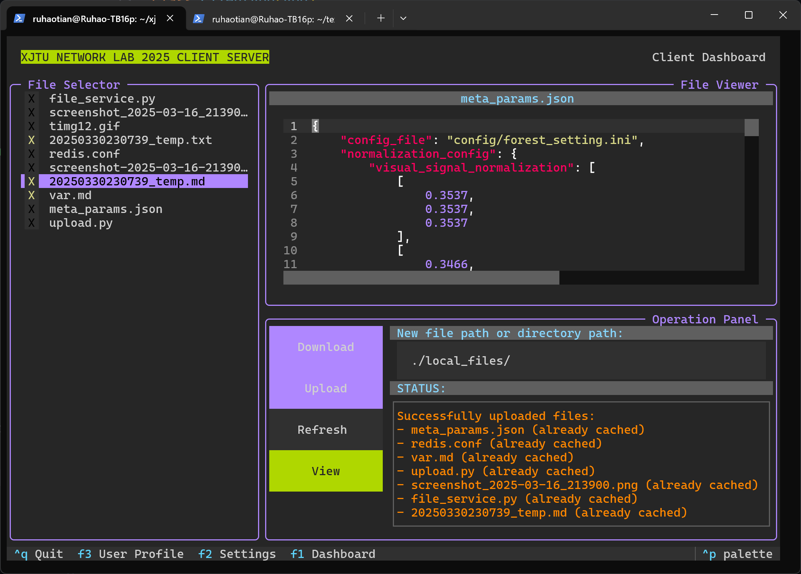

# 西安交通大学 计算机网络课程实验 2025 课程项目：基于HTTP协议的客户端程序（文本浏览器）

## 实验报告及文档

- [请见report文件夹final_report.pdf](./report/)

## 实现功能

### 基本功能

- 实现GET、HEAD、POST三种请求方法
- 实现十六进制替换URL中的不安全字符
- 实现可选择的持久连接
- 实现批量获取服务器对象
- 实现基于Cookie的网站登陆和Session有状态连接
- 实现重定向并可定义重定向/重试次数
- 实现基于MD5哈希校验的文件缓存
- 实现常见错误码的处理和用户友好的错误提示

### 高级功能

- 实现分块传输编码
- 实现gzip内容编码并与分块传输兼容
- 实现基于POST方法的批量文件上传
- （额外功能）客户端实现Socket传输重试和非阻塞模式数据读取
- （额外功能）客户端实现基于Textual TUI的响应式交互界面
- （额外功能）客户端实现服务器文本文件实时预览和代码高亮
- （额外功能）后端APACHE服务器实现基于WSGI的自定义服务API
